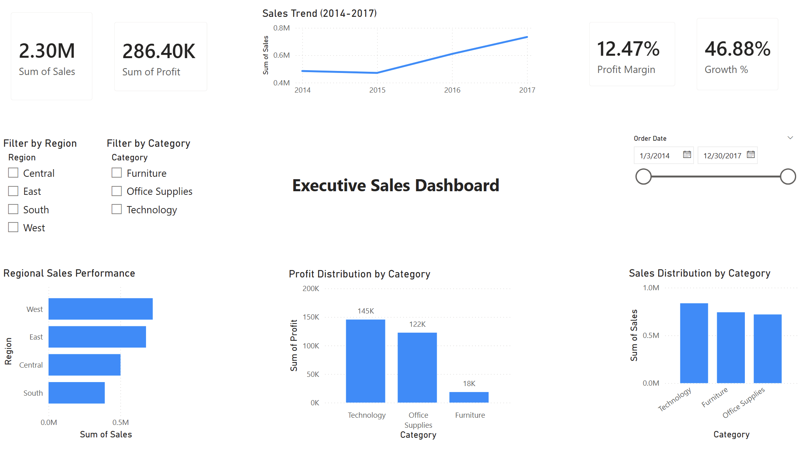
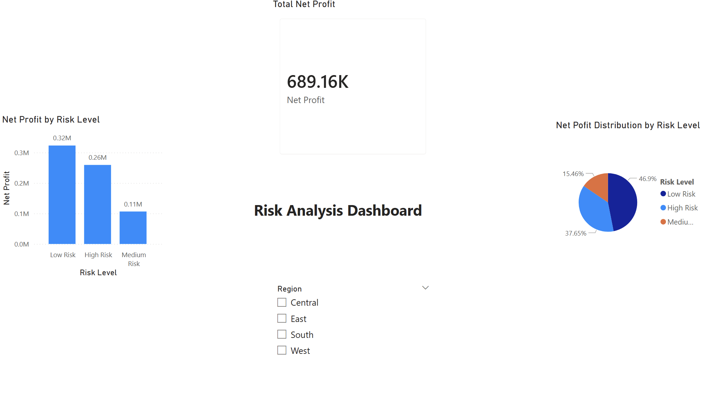

# Data Analytics Portfolio  
### Aspiring Data Analyst | Python • SQL • Power BI • Machine Learning

This portfolio demonstrates end-to-end data analytics projects covering data analysis, machine learning, SQL, and interactive dashboards. 

Each project focuses on solving real-world business problems using data-driven insights, with an emphasis on decision-making, performance analysis, and storytelling through data.

---

###  Projects Portfolio

### 1. Customer Behavior Analysis
📂 [View Code](./Customer_Behavior_Analysis_using_Python.ipynb)
- Analyzed retail sales data using Python
- Identified top customers, regions, and product categories
- Visualized trends and generated business insights

**Result:** Identified Technology as top-performing category, contributing highest revenue.

**Insight**: Technology category generates highest sales, indicating strong demand in this segment.

### 2. Sales Prediction Model
📂 [View Code](./Sales_Prediction_Model.ipynb)
- Built a machine learning model to predict sales
- Used regression techniques
- Evaluated model performance

**Result:** Developed a regression model to forecast sales trends and support decision-making.

### 3. Superstore Sales Analysis (SQL Project)

#### Overview
Analyzed retail sales dataset using SQL to extract key business insights including total sales, profit, customer performance, and category trends.

### Tools Used
- SQL (SQLite)
- Visual Studio Code

### Key Insights
- Technology is the top-performing category (~836K sales)
- Top customer generated over 25K in sales
- Regional performance varies significantly
- High-value customers drive major revenue

### Sample Output

### 4. Executive Risk & Profit Analysis Dashboard (Power BI)

### Overview  
Built an interactive Power BI dashboard to analyze profit performance and risk segmentation across regions, categories, and time.
Designed for executive-level decision-making with clear KPIs, trend analysis, and category performance insights.

### Tools Used  
- Power BI  
- Excel (Superstore dataset)

### Key Features  
- KPI cards for Total Sales, Total Profit, Profit Margin & Growth %
- Sales trend over time  
- Regional performance analysis
- Category-wise breakdown  
- Interactive filters (Region, Category, Date)
- Risk segmentation using Profit Margin (High, Medium, Low)

### Key Insights  
-  ⁠Low-risk segments contribute the highest profit  
-  ⁠High-risk segments generate revenue but with lower margins  
-  ⁠Technology is the most profitable category  
-  ⁠West and East regions outperform other regions 

### Business Impact
- ⁠Identifies profitable vs risky segments for better decision-making
- ⁠Enables management to optimize strategy based on risk levels  
- Supports performance monitoring through KPI tracking  
- Improves planning using trend and segmentation analysis

**Result:** Built an interactive dashboard for real-time business insights and KPI tracking.

### Dashboard Preview  

### Main Dashboard

### Risk & Profit Analysis

###  Dataset
- Superstore dataset used for analysis

---

###  Skills Used
- Python (Pandas, Matplotlib)
- SQL
- Data Analysis
- Machine Learning
- Power BI
- Data Visualization
- Business Insights & Storytelling

---

###  Author
- **Mohammed Shadid**
